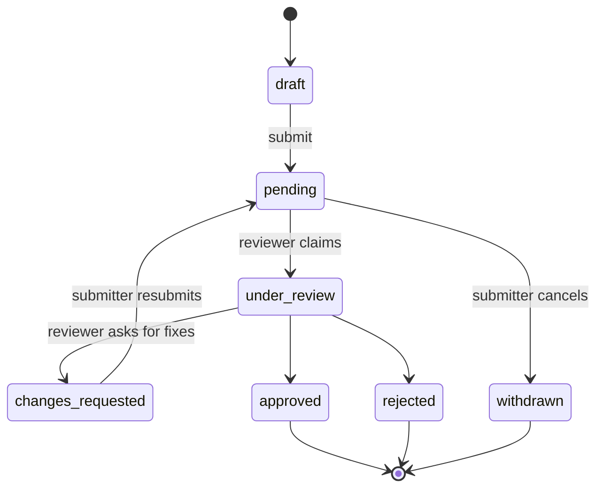

# Digital Library - Project Plan

Status: v1, M0 to M9 built
Date: 2026-08-29
Owner: ADK DEV
Companion docs: `README.md` (users), `DEVDOC.md` (contributors). Both are written after this plan is agreed.

---

## 1. What this is

An open source, self-hostable digital library. A community collects books and documents, organises them into deep folder-like collections (for example "UPSC Preparation > History > Ancient India"), and reads them in the browser. Everything a member contributes - a file, a new category, a new collection branch - goes through a review queue before it becomes public.

Three levels of usage:

| Level | Who | Core ability |
|---|---|---|
| Member | anyone who signs up | browse, read, request books, upload books, propose categories/tags/collections, build personal shelves |
| Librarian | trusted member, approved by an admin | review and approve/reject everything members submit, upload directly without review, curate collections, moderate reviews |
| Admin | project owner and deputies | everything a librarian can do, plus approve librarians, manage roles and permissions, site settings, takedowns, audit log, storage |

A fourth implicit level, Guest, can browse and search public metadata but cannot read files or contribute.

### Design principles

1. Nothing public without review. Every content-changing action by a member creates a moderation request.
2. One approval engine. Book uploads, category proposals, collection publishing and librarian applications all move through the same state machine, so the review UI and the audit log are uniform.
3. Runs on a cheap host. PHP 8.3 + MySQL, no queue daemon required for the core flows, no build step for the frontend.
4. Contributor friendly. Small hand-rolled MVC, PSR-12, no framework to learn, every module under 300 lines where possible.

---

## 2. Stack decision

| Layer | Choice | Why |
|---|---|---|
| Language | PHP 8.3 (typed properties, enums, readonly, first-class callables) | Requested. Enums map cleanly onto the workflow states. |
| Structure | Hand-rolled MVC core in `app/Core` (Router, Request, Response, Container, View, Validator, Auth, Csrf, Db) | Lowest barrier for open source contributors, runs on shared hosting and XAMPP, nothing hidden behind magic. |
| Database | MySQL 8 / MariaDB 10.6+, accessed through PDO with prepared statements only | FULLTEXT search, JSON columns, recursive CTEs for the collection tree. |
| Templates | Plain PHP views with `htmlspecialchars` output helper `e()`, layout + partial includes | No template compiler to ship or learn. |
| Frontend | Server-rendered HTML, vanilla JS modules, CSS custom properties for theming. PDF.js for the PDF reader, epub.js for EPUB. | No node build step required to run the app. |
| Composer packages (kept deliberately few) | dev only at M0: PHPUnit, PHPStan, PHP_CodeSniffer. Runtime: `phpmailer/phpmailer` from M1, `smalot/pdfparser` from M3, GD for covers. The .env reader is hand-rolled so the app boots without `vendor/`. | Each dependency has to justify itself in DEVDOC. |
| Dev tooling | PHPUnit, PHPStan level 6, PHP_CodeSniffer (PSR-12), GitHub Actions | |
| Search | MySQL FULLTEXT by default, behind a `SearchDriver` interface so a Meilisearch driver can be dropped in later | |
| Files | Local disk in a private `storage/` directory outside the webroot, streamed by an authenticated controller with HTTP range support | Access control, download accounting, resumable reads, quarantine for unreviewed uploads |

Rejected for now: Laravel (contributor barrier, heavier deploy), Slim (still a framework to learn for little gain at this size). Both are noted in DEVDOC as viable forks.

---

## 3. Roles and permissions

Permissions are stored as string keys and granted to roles; a user has exactly one primary role plus optional grants, so an admin can hand a single extra permission to a member without promoting them.

| Permission | Guest | Member | Librarian | Admin |
|---|:--:|:--:|:--:|:--:|
| `catalog.browse` | yes | yes | yes | yes |
| `book.read` (open in reader) | no | yes | yes | yes |
| `book.download` | no | yes | yes | yes |
| `book.upload` (into review queue) | no | yes | yes | yes |
| `book.publish` (goes live immediately) | no | no | yes | yes |
| `book.edit.own` | no | yes | yes | yes |
| `book.edit.any` | no | no | yes | yes |
| `book.delete` | no | no | soft | hard |
| `request.create` | no | yes | yes | yes |
| `request.vote` | no | yes | yes | yes |
| `request.fulfil` | no | yes (upload against it) | yes | yes |
| `request.close` | no | own only | yes | yes |
| `taxonomy.propose` (category or tag) | no | yes | yes | yes |
| `taxonomy.manage` | no | no | yes | yes |
| `collection.create.private` | no | yes | yes | yes |
| `collection.propose.public` | no | yes | yes | yes |
| `collection.approve` | no | no | yes | yes |
| `review.write` | no | yes | yes | yes |
| `review.moderate` | no | no | yes | yes |
| `moderation.queue` | no | no | yes | yes |
| `librarian.apply` | no | yes | - | - |
| `librarian.approve` | no | no | no | yes |
| `user.manage` (ban, quota, role) | no | no | limited (mute) | yes |
| `settings.manage` | no | no | no | yes |
| `takedown.handle` | no | no | triage | decide |
| `audit.view` | no | no | own actions | all |

Escalation path: Member applies for librarian -> application is a moderation request of type `librarian_application` -> only an admin can approve. Admins are seeded by CLI (`php cli/console.php user:promote <email> admin`); the first registered user of a fresh install is offered admin during setup.

---

## 4. Content model

### 4.1 Books

A **book** is the bibliographic record. A **book file** is a downloadable artefact attached to it, so one book can carry a scanned PDF, a clean PDF and an EPUB without duplicating metadata.

Book fields: title, subtitle, slug, authors (many), publisher, published_year, edition, language, isbn10/isbn13, description, cover image, page count, content type, licence, source URL, added_by, status, published_at.

`content_type` covers the "stories, kids, movies" axis at the record level: `book`, `magazine`, `comic`, `academic_paper`, `notes`, `audiobook`, `video`. It decides which reader opens and which metadata fields show.

`licence` is one of `public_domain`, `cc_by`, `cc_by_sa`, `cc_other`, `author_permission`, `unknown`. See section 9.

### 4.2 Categories - the fixed taxonomy

Hierarchical, admin/librarian controlled, one book can sit in several. Examples the user asked for: Stories, Kids, Movies, plus Academics, Competitive Exams, Religion, Technology, Magazines, Comics.

Stored with `parent_id` plus a materialised `path` column (`/stories/folk-tales/`) so a subtree fetch is one indexed `LIKE 'path%'` query and a breadcrumb needs no recursion.

Members can propose a new category; it lands in the queue as `taxonomy_proposal`.

### 4.3 Tags - the flat descriptive layer

Romance, science, fiction, thriller, biography, class-10, ncert, upsc, hindi. Free-form on entry, but a proposed tag that does not already exist is created in `pending` state and only becomes suggestible to others after a librarian approves it. Tag aliases fold "sci-fi" into "science-fiction" so the catalogue does not fragment.

### 4.4 Collections - the deep folder tree

This is the feature the user described with "UPSC preparation as folder, in that subject wise folders, and deep like this".

A collection node is either a folder or a leaf holding books; any node can hold both child folders and books. Unlimited depth (soft cap 8 levels, configurable).

```
UPSC Preparation                     (collection, public, approved)
+-- Prelims
|   +-- History
|   |   +-- Ancient India            -> 12 books
|   |   +-- Medieval India           -> 9 books
|   |   \-- Modern India             -> 21 books
|   +-- Geography
|   \-- Polity
+-- Mains
|   \-- Optional Subjects
|       \-- Anthropology
\-- Previous Year Papers             -> 40 books
```

Visibility: `private` (personal shelf, no approval needed), `unlisted` (link only, no approval), `public` (needs approval). Publishing a public collection sends the whole subtree to the queue as one `collection_publish` request; the reviewer sees a diff-style tree of what is being added.

Other collection behaviour:
- Fork a public collection into your own private copy, keep editing it, propose it back.
- Follow a collection and get notified when a book is added.
- Co-maintainers: the owner can invite other members to edit a collection.
- A book can appear in any number of collections; a collection can also pull in a saved search ("all books tagged `ncert` + category Academics") as a smart node.
- Export a subtree as a ZIP or as an OPDS feed for e-reader apps.

### 4.5 Book requests

A member asks for something the library does not have: title, author, ISBN if known, a note, optional category/tag hints.

Lifecycle: `open` -> (`claimed` by a librarian or a member who says they will upload) -> `fulfilled` (linked to the book that satisfied it) or `rejected` / `duplicate` / `unavailable`.

Requests are upvotable, so the queue can be sorted by demand. A member uploading a file can attach it to an open request, which links the two workflows: approving the upload auto-fulfils the request and notifies every upvoter.

---

## 5. The approval engine

One table, one state machine, many subject types.



Subject types handled by the same engine:

| Type | Created by | Approved by | Effect of approval |
|---|---|---|---|
| `book_upload` | member | librarian | file moves quarantine -> library, book set public |
| `book_edit` | member (on a book they do not own) | librarian | metadata patch applied |
| `book_delete` | member or librarian | librarian / admin | soft delete |
| `taxonomy_proposal` | member | librarian | category or tag becomes active |
| `collection_publish` | member | librarian | subtree becomes public |
| `librarian_application` | member | admin only | role changed to librarian |
| `takedown` | anyone, including guests | admin | book unpublished, reason recorded |
| `report` (bad file, wrong metadata, abuse) | member | librarian | routed to the right owner |

Rules that keep the queue honest:
- A reviewer cannot approve their own submission. Admins can, but the audit log flags it.
- Claiming locks a request for 30 minutes so two librarians do not review the same thing.
- Every transition writes a `moderation_events` row (actor, from, to, reason) and a notification to the submitter.
- Rejection requires a reason; a canned-reason list keeps it consistent (duplicate, poor scan quality, wrong metadata, copyright, off-topic, spam).
- Threaded comments on the request let reviewer and submitter talk without email.
- SLA view: requests older than N days are highlighted; the dashboard shows median time to decision.

---

## 6. Upload pipeline

1. **Client** picks a file, sees an immediate SHA-256 computed in the browser and a duplicate warning if the hash is known.
2. **Receive** - chunked upload endpoint, resumable, per-user daily quota and per-file size cap from settings.
3. **Validate** - extension allowlist (`pdf epub mobi djvu cbz txt mp3 m4b mp4`), real MIME sniff, magic-byte check, size, and a hard reject on anything executable or on a PDF containing JavaScript actions.
4. **Quarantine** - stored in `storage/quarantine/{hash-prefix}/{hash}` with mode 0640, never reachable by URL.
5. **Enrich** - extract page count and embedded title/author, generate a cover from page 1, extract first ~2000 words for the search index. Optional ClamAV scan if `clamdscan` is present.
6. **Deduplicate** - exact match on SHA-256, plus fuzzy title+author match to suggest "is this the same as X?" to the reviewer.
7. **Metadata assist** - if an ISBN is present, offer a one-click fetch from OpenLibrary (opt-in, off by default so the install makes no outbound calls unless enabled).
8. **Queue** - a `book_upload` moderation request is created.
9. **On approval** - file is hard-linked into `storage/library/`, book set to public, uploader gains reputation, followers and request upvoters are notified.
10. **On rejection** - file deleted from quarantine after a 7 day grace window so the submitter can fix and resubmit.

Downloads and reads always go through `GET /files/{token}` which checks permission, honours `Range` for streaming, logs the event, and never exposes a filesystem path.

---

## 7. Feature list

### Reading and discovery
- In-browser reader: PDF.js for PDF, epub.js for EPUB, native `<audio>`/`<video>` for audiobooks and video, with keyboard navigation.
- Reading progress synced per user per file, resume where you left off, plus bookmarks and highlights with notes.
- Search: title, author, description, tags, and full text of extracted content, with facets for category, tag, language, year, content type, file format.
- Saved searches, and a saved search can be mounted as a smart node inside a collection.
- Series support ("Harry Potter #3"), related books, "readers also opened".
- Featured shelf, book of the week, recently added, most downloaded, staff picks.
- RSS and OPDS feeds per category, tag and collection.
- Personal shelves: Want to read, Reading, Finished, Favourites.

### Community
- Ratings (1-5) and reviews with librarian moderation and helpful votes.
- Reputation points for accepted uploads, fulfilled requests, useful reviews and reviewing (for librarians), with badges and a contributor leaderboard.
- Public contributor profile: uploads accepted, requests fulfilled, collections curated.
- Comment threads on requests and moderation items.
- Notifications in-app plus optional email digest (immediate, daily, weekly, off).

### Librarian tools
- Unified queue with filters by type, age, category and claim state, plus bulk approve/reject for trusted uploaders.
- Side-by-side review screen: file preview, extracted metadata, duplicate candidates, submitter history.
- Metadata batch editor, merge two duplicate books, split a mis-merged one.
- Collection curation view with drag-and-drop reordering and move-subtree.
- Canned rejection reasons, and a "request changes" flow instead of a flat no.

### Admin tools
- Role and permission editor, librarian applications, promote/demote, ban and mute with expiry.
- Site settings: name, logo, theme, registration open/invite-only/closed, quotas, allowed formats, feature flags for reviews, ratings, public API, ISBN lookup.
- Full audit log with actor, IP, before/after JSON, exportable as CSV.
- Storage dashboard: disk used, orphan files, quarantine age, integrity check that verifies stored hashes.
- Analytics: signups, uploads, approvals, downloads, top categories, queue throughput, all rendered server-side from aggregate tables.
- Takedown console with a public-facing report form and a documented response process.
- Maintenance mode, backup/restore helper, cache and search reindex commands.

### Platform
- Read-only public REST API (`/api/v1`) with token auth, rate limits and cursor pagination; write endpoints for upload behind a scoped token.
- i18n from day one: all strings through `t()`, locale files in `resources/lang`, English and Hindi shipped.
- Light and dark theme from CSS custom properties, respects `prefers-color-scheme`.
- Accessibility target WCAG 2.1 AA: labelled controls, focus states, skip links, reader keyboard shortcuts.
- Docker Compose for one-command local setup, plus a plain LAMP install path.
- Seed data with public-domain books so a fresh clone is not empty.

---

## 8. Data model

Tables, grouped. Every table has `id BIGINT UNSIGNED AUTO_INCREMENT`, `created_at`, `updated_at`; content tables also have `deleted_at`.

**Identity**
`users` (name, username, email, password_hash, role, status, avatar, bio, reputation, storage_used, storage_quota, email_verified_at, last_seen_at)
`sessions`, `password_resets`, `email_verifications`, `api_tokens` (token_hash, scopes, expires_at), `login_attempts`
`permissions`, `role_permissions`, `user_permissions` (individual grants and revokes)

**Catalogue**
`books` (with a `language` ISO code column), `authors`, `book_authors` (with `role`: author, editor, translator, illustrator), `publishers`, `series`, `book_series` (position)
`book_files` (book_id, format, storage_path, sha256, size_bytes, page_count, quality, is_primary, downloads)
`book_covers`, `book_texts` (extracted text for FULLTEXT)

**Taxonomy**
`categories` (parent_id, name, slug, path, icon, description, status, sort_order), `book_categories`
`tags` (name, slug, status, usage_count), `tag_aliases`, `book_tags`

**Collections**
`collections` (parent_id, root_id, path, depth, name, slug, description, owner_id, visibility, review_status, item_count, follower_count, forked_from_id)
`collection_items` (collection_id, book_id, position, added_by, note)
`collection_maintainers`, `collection_followers`

**Requests and moderation**
`book_requests` (title, author, isbn, note, requester_id, status, fulfilled_by_book_id, vote_count), `book_request_votes`
`moderation_requests` (subject_type, subject_id, submitter_id, assignee_id, status, priority, payload JSON, reason, claimed_until, decided_at, decided_by)
`moderation_events`, `moderation_comments`
`librarian_applications` (user_id, statement, experience, decided_by)
`reports` (subject_type, subject_id, reporter_id, category, detail, status)
`takedowns` (book_id, claimant_name, claimant_email, basis, status, action_taken)

**Engagement**
`reviews` (rating and optional body, one per person per book), `review_votes`
`reading_progress` (user_id, book_file_id, position, percent, last_read_at), `bookmarks` (with a note)
`shelf_items` (user_id, book_id, shelf enum)
`notifications`, `notification_preferences`
`badges`, `user_badges`, `reputation_events`

**Operations**
`audit_logs` (actor_id, action, subject_type, subject_id, before_state JSON, after_state JSON, ip_hash, user_agent)
`downloads` (book_file_id, user_id, ip_hash, bytes_sent, created_at), `page_views`
`settings` (key, value JSON, group), `feature_flags`
`jobs` (simple DB-backed queue for email and text extraction, drained by cron)
`migrations`

Indexing notes: FULLTEXT on `books(title, subtitle, description)` and `book_texts(content)`; unique on `book_files.sha256`; composite on `moderation_requests(status, subject_type, created_at)`; prefix index on `collections.path` and `categories.path`.

---

## 9. Legal and safety

A community upload site for books has an obvious copyright exposure, so the design treats it as a first-class concern rather than an afterthought. This is what makes the project deployable in good conscience.

- Every book carries a required `licence` field. The upload form asks for the basis (public domain, Creative Commons, author permission, own work, uncertain) and refuses to submit without one.
- The default install ships with `settings.require_licence_evidence = true`, which makes reviewers confirm the basis before approving.
- A public `/report` form (no login needed) and an admin takedown console with recorded action and response time.
- Repeat-infringer tracking: uploads rejected for copyright are counted per user and trigger review after N strikes.
- The install wizard shows a plain-language notice that the operator, not the software, is responsible for what their instance hosts, and links to a `docs/OPERATING-LEGALLY.md`.
- Robots and sitemap settings so an operator can keep an instance private.

Security baseline: Argon2id password hashing, CSRF token on every state-changing form, prepared statements everywhere, `Content-Security-Policy` with no inline script, per-route rate limits, session regeneration on login, signed download tokens with short TTL, uploads never executable, admin actions re-authenticated after 30 minutes.

---

## 10. Application structure

```
digital-library/
  public/                  # the only web-exposed directory
    index.php              # front controller
    assets/{css,js,img}
  app/
    Core/                  # Router, Request, Response, Container, View, Db, Auth, Csrf,
                           # Validator, Mailer, Storage, Search, Policy, Event
    Controllers/           # Web/ and Api/
    Models/                # thin entities
    Repositories/          # all SQL lives here
    Services/              # UploadPipeline, ModerationService, CollectionTree,
                           # TaxonomyService, ReputationService, NotificationService
    Middleware/            # Authenticate, Authorize, RateLimit, VerifyCsrf, Locale
    Views/                 # layouts/, partials/, pages/
  config/                  # app.php, database.php, storage.php, mail.php
  database/
    migrations/            # NNNN_description.sql, applied by the CLI
    seeds/                 # from M2
  storage/                 # never web-exposed
    library/  quarantine/  covers/  cache/  logs/  backups/
  resources/lang/{en,hi}/    # from M9
  cli/console.php          # migrate, seed, user:promote, storage:verify, search:reindex,
                           # jobs:work, quarantine:prune
  tests/{Unit,Feature}/
  docs/                    # API.md, OPERATING-LEGALLY.md, screenshots
  .github/workflows/ci.yml
  README.md  DEVDOC.md  PLAN.md  CONTRIBUTING.md  CODE_OF_CONDUCT.md  LICENSE
```

Request flow: `public/index.php` -> load env and config -> container -> Router match -> middleware stack -> Controller -> Service -> Repository -> View. Controllers hold no SQL and no business rules.

---

## 11. Route map (first pass)

| Method | Path | Access | Purpose |
|---|---|---|---|
| GET | `/` | guest | home, featured, recent |
| GET | `/search` | guest | faceted search |
| GET | `/books/{slug}` | guest | book page |
| GET | `/books/{slug}/read/{fileId}` | member | reader |
| GET | `/files/{token}` | member | stream or download |
| GET/POST | `/upload` | member | contribute a book |
| GET | `/categories/{path...}` | guest | category browse, any depth |
| GET | `/tags/{slug}` | guest | tag browse |
| GET | `/collections` | guest | public collections |
| GET | `/collections/{path...}` | mixed | collection node, any depth |
| POST | `/collections/{id}/items` | member | add book to own collection |
| POST | `/collections/{id}/publish` | member | propose public |
| GET/POST | `/requests` | member | book requests list and create |
| POST | `/requests/{id}/vote` | member | upvote |
| GET | `/u/{username}` | guest | contributor profile |
| GET | `/me/*` | member | shelves, progress, notifications, settings |
| GET | `/librarian/queue` | librarian | moderation queue |
| GET/POST | `/librarian/review/{id}` | librarian | review screen and decision |
| GET | `/librarian/taxonomy` | librarian | categories and tags |
| GET | `/admin/users` | admin | user management |
| GET | `/admin/librarians` | admin | applications |
| GET | `/admin/settings` | admin | site settings and flags |
| GET | `/admin/audit` | admin | audit log |
| GET | `/admin/storage` | admin | storage and integrity |
| GET | `/api/v1/books` | token | public read API |
| GET | `/report` | guest | abuse and takedown form |

---

## 12. Delivery plan

Each milestone ends with the app runnable and the docs updated in the same commit range.

| Milestone | Contents | Rough size |
|---|---|---|
| M0 Foundation | repo hygiene, `.gitignore`, licence, CI, Docker Compose, MVC core, migration runner, config, layout and theme, ADK DEV mark wired in | done |
| M1 Identity | register, verify, login, reset, sessions, roles and permissions, profiles, admin user list, seeded admin | done |
| M2 Catalogue | books, authors, files, categories, tags, book page, browse, basic search, seed data | done |
| M3 Upload and moderation | upload pipeline, quarantine, moderation engine, librarian queue, review screen, notifications | done |
| M4 Requests | book requests, votes, claim, fulfilment linked to uploads | done |
| M5 Collections | tree model, personal shelves, public proposal and approval, curation, fork and follow | done |
| M6 Reading | PDF and EPUB readers, progress, bookmarks, downloads with range support | done |
| M7 Community | reviews, ratings, reputation, badges, leaderboard, profiles | done |
| M8 Admin and ops | settings, feature flags, audit log, storage dashboard, analytics, takedowns, applications | done |
| M9 Polish | full text search, API, OPDS and RSS, i18n Hindi, accessibility pass | done |

MVP line: M0 through M4 is a usable library with the three roles and the approval loop working end to end. Everything after that is depth.

---

## 13. Open source setup

- Licence: **MIT**, shipped in `LICENSE`. This was AGPL-3.0-or-later at M0, on the reasoning that anyone
  running a modified public instance should have to publish their changes. Changed to MIT on 2026-09-30:
  the point of this is to be picked up and run by a hostel, a department or a small library, and a copyleft
  obligation on a self-hosted instance is friction those people should not have to read about. Relicensing
  was clean because every commit is by one author. The seeded catalogue is separate and always was: those
  books are public domain, and nothing here claims anything over what you upload to your own instance.
- `CONTRIBUTING.md`: local setup in under five commands, coding standard (PSR-12, PHPStan level 6), commit style, how to add a migration, how to add a permission.
- `CODE_OF_CONDUCT.md`: Contributor Covenant 2.1.
- Issue and PR templates, labels including `good first issue` and `help wanted`, and a starter set of scoped issues carved out of M2 and M7.
- CI on every PR: lint, static analysis, unit and feature tests against MySQL in a service container.
- `DEVDOC.md` carries the request-flow and approval-state diagrams so a new contributor can orient in one read.
- Demo instance with seeded public-domain content, reset nightly.

---

## 14. Risks and how the design answers them

| Risk | Answer |
|---|---|
| Copyright liability | section 9: mandatory licence basis, takedown console, repeat-infringer tracking, operator notice |
| Reviewer burnout, queue backlog | claim locks, canned reasons, bulk actions for trusted uploaders, reputation-based auto-approve threshold, SLA dashboard |
| Storage growth | per-user quotas, deduplication by hash, quarantine pruning, admin storage dashboard, optional S3 driver later behind the `Storage` interface |
| Taxonomy sprawl | tags need approval before they become suggestible, aliases fold synonyms, librarian merge tool |
| Deep collection trees performing badly | materialised `path` column, depth cap, subtree fetch in one query |
| Malicious uploads | MIME sniffing, extension allowlist, no execution path, quarantine outside webroot, optional ClamAV |
| Hand-rolled MVC drifting into a bad framework | keep `app/Core` small and covered by unit tests; anything that grows past its remit becomes a Composer dependency instead |
| Contributor drop-off | small modules, seeded good-first-issues, one-command Docker setup, docs kept in the same PR as the code |

---

## 15. Decisions still open

1. Whether audiobook and video content types ship in v1 or wait, given the storage cost.
2. Whether reputation can ever auto-approve an upload without a human, and at what threshold.
3. Instance federation (one library discovering another's catalogue over OPDS) - interesting, deliberately out of scope for v1.

Settled at M0: the licence (AGPL-3.0-or-later, changed to MIT on 2026-09-30, see section 13) and the
default mail transport
(`MAIL_DRIVER=log`, which writes messages to `storage/logs` so a fresh install
needs no SMTP credentials).

Settled at M1: the first account registered on an empty install becomes a
verified admin, because an install with no admin can never promote anyone. Email
delivery is PHPMailer over SMTP when `MAIL_DRIVER=smtp`, PHP's `mail()` when
`mail`, and the log file otherwise.

Settled at M9: the public API is read-only and unauthenticated, because
everything it returns is what a guest can already see on the website; a token
would only be theatre. Rate limiting counts in files under storage/cache rather
than a table, since a limiter that writes to the database on every request costs
more than the requests it protects. Translation covers the interface chrome, not
the pages: every string has to move through `t()` before it can be translated,
and claiming Hindi for text that is still English would be worse than saying so.

Settled at M8: librarian applications get their own admin screen rather than a
place in the moderation queue, because every librarian can see the queue and
only an admin may decide who becomes one. Settings that change behaviour are read
from the database at the point of use, so a change takes effect immediately
without a deploy or a restart. Maintenance mode exempts the health check: a
monitor that cannot tell "closed for an hour" from "down" is not much of a
monitor.

Settled at M7: reputation is a running total on the user row plus an event per
award, because without the events nobody could answer "why do I have 47 points?"
and a badge would have nothing to count. A badge is data rather than code: a row
naming an action and a threshold. An award can be made idempotent by naming its
subject, so approving the same upload twice pays once. A hidden review stays
visible to the person who wrote it, and leaves the average.

Settled at M6: PDF.js, epub.js and JSZip are committed under
`public/assets/vendor` rather than pulled from a CDN. The Content-Security-Policy
allows scripts from this origin only and the project has no build step, so
vendoring is the only way to have a reader at all; the alternative was weakening
the CSP for everyone to save two megabytes in the repository. Highlights are
folded into bookmarks: a bookmark carries a note, and a separate highlight table
would need text ranges the PDF reader cannot give us anyway.

Settled at M5: a collection is published whole rather than folder by folder, so
the reviewer sees the tree they are approving. Visibility and review state are
separate columns, because "who can see it" and "how far has its request got" are
different questions and conflating them made the private case wrong. Reordering
is up and down buttons rather than drag and drop: dragging needs JavaScript the
CSP would have to allow, for an ordering people set once. Smart nodes (a saved
search mounted as a folder) are deferred rather than half built; the columns for
them are not in the schema.

Settled at M4: asking for a book counts as a vote for it, because making the
requester click again would only make the demand ordering wrong. A record
submitted with no file is a queue item of its own (`book_record`), so a member's
metadata-only contribution cannot sit in `pending` with nothing pointing a
reviewer at it. Fulfilment is never a status someone picks from a dropdown: it
comes from a book arriving.

Settled at M3: a PDF carrying JavaScript, a launch action or an auto-run action
is refused outright rather than flagged for a reviewer, because a library is a
poor place to learn that a reader honours them. Cover generation from page one
needs Imagick, which is not a dependency this project wants, so covers stay a
manual upload until someone needs otherwise. Tag proposals stay a lightweight
approve list rather than queue items: a tag is one word and does not need a
review thread.

Settled at M2: languages are an ISO code column on `books` rather than the
`languages` table this plan sketched, because nothing needs a row per language
until translated interface names arrive in M9. A book's address stops following
its title once the record is published, so existing links keep working. A
category's book count is its whole subtree's, which is what clicking it shows.
