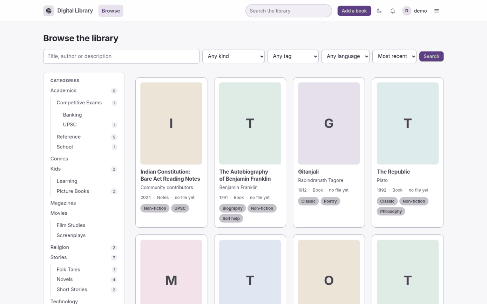
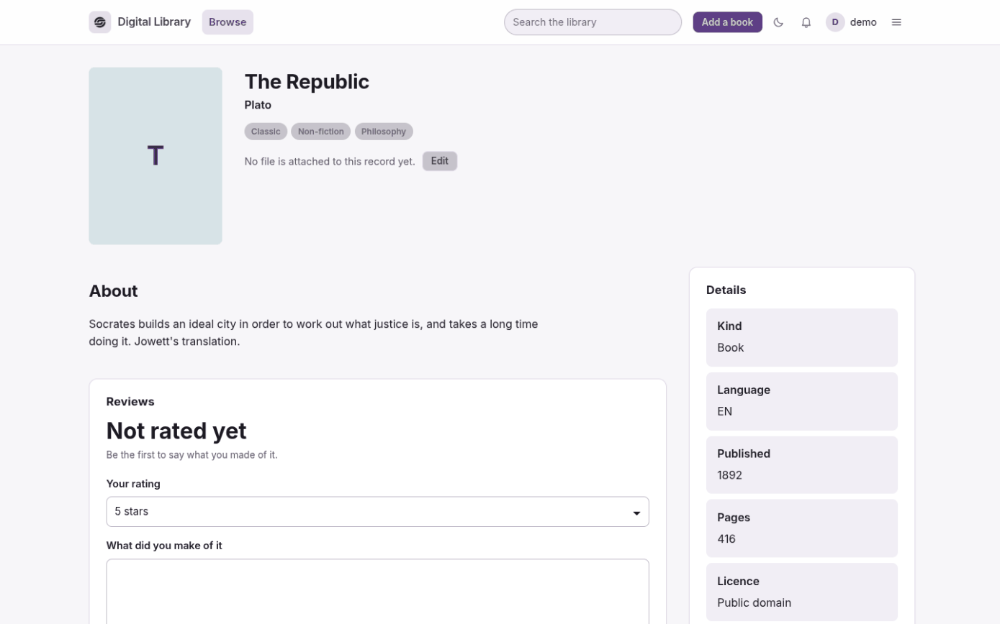
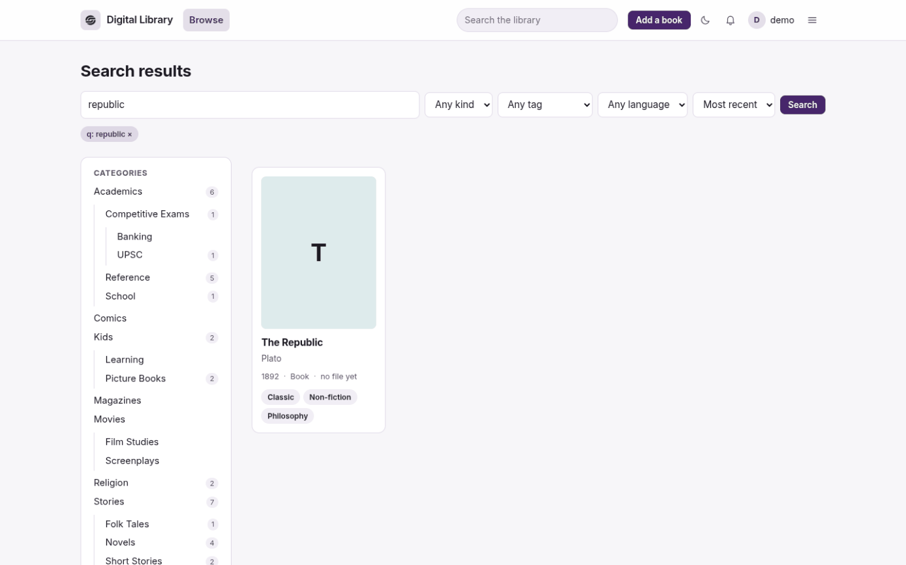
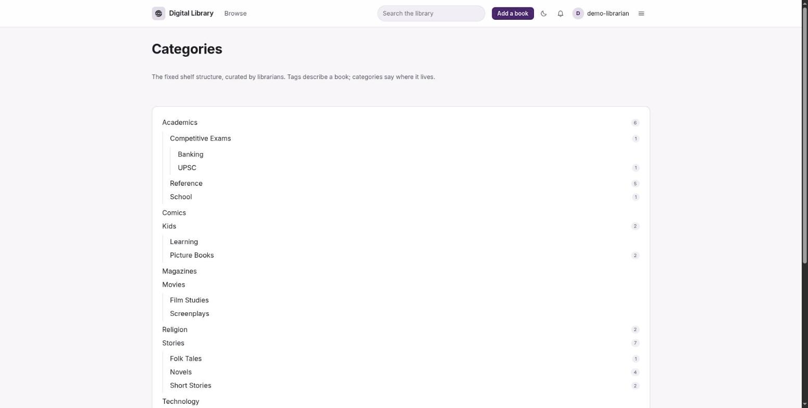
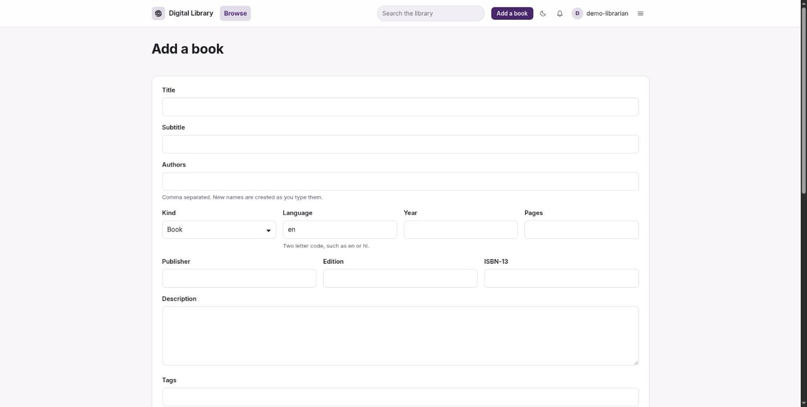
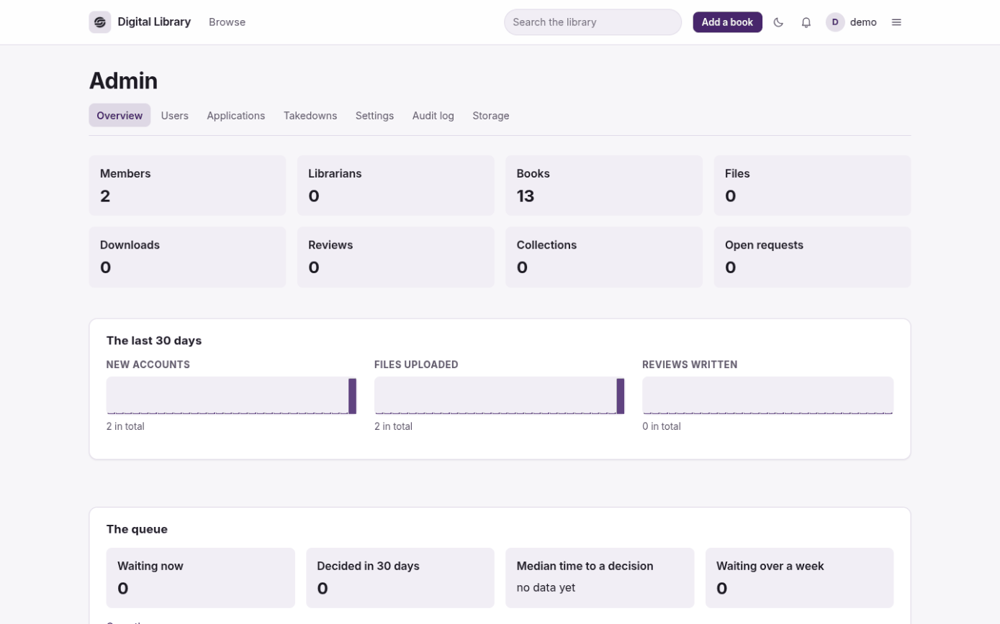
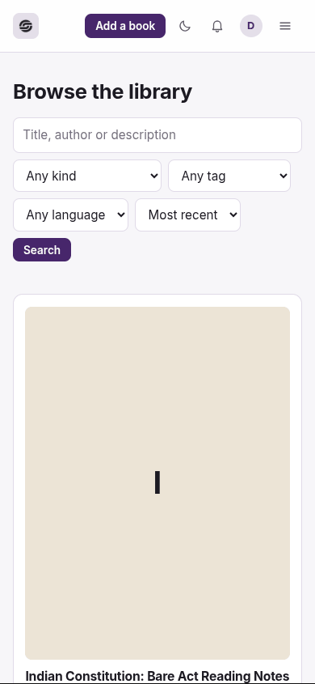
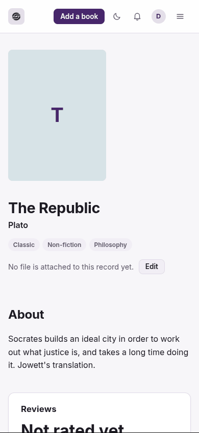
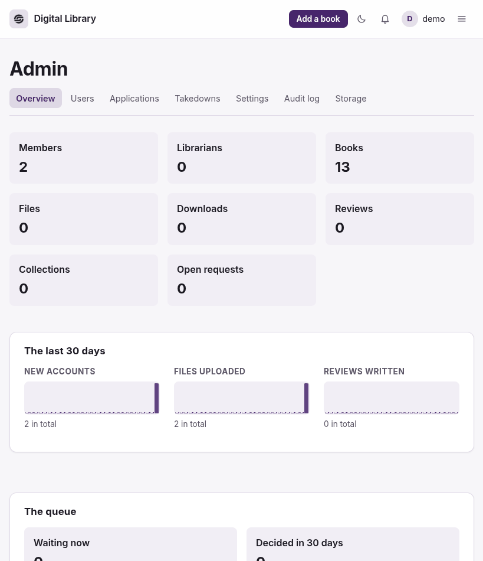

<!-- Generated from README.md by scripts/build-light-readme.php. Do not edit by hand. -->

<div align="center">

<picture>
  <source media="(prefers-color-scheme: dark)" srcset="./docs/assets/adk_dev_logo_light.png">
  
</picture>

# Digital Library

**An open source digital library that a community fills in together. Members find books, read them in the browser, ask for the ones that are missing and upload the ones they have. Librarians review everything before it goes public.**


<br>


<br><br>

**[Developer documentation](./DEVDOC.md)** · [Screenshots](#screenshots) · [Getting started](#getting-started)

<p><b>Light mode</b> · <a href="./README.md">View this page in dark mode</a></p>

</div>

---

## Contents

- [Why this project matters](#why-this-project-matters)
- [Screenshots](#screenshots)
- [Responsive layout](#responsive-layout)
- [The interface](#the-interface)
- [Roles](#roles)
- [How a contribution becomes a book](#how-a-contribution-becomes-a-book)
- [Asking for a book](#asking-for-a-book)
- [Organising books](#organising-books)
- [Getting started](#getting-started)
- [Contributors](#contributors)
- [Contributing](#contributing)
- [License](#license)

---

## Why this project matters

A community that wants a shared library has two bad options. Put the files in a
drive folder, and within a year nobody can find anything and nobody knows what is
allowed to be there. Or use a hosted platform, and the collection lives at
somebody else's discretion, under somebody else's takedown policy.

This is the third option: a library the community actually runs, on its own MySQL
and its own disk, with no build step and no cloud account.

The design problem that follows is trust. If anyone can upload, the collection
fills with duplicates, mislabelled files and things that should not be there. So
**nothing a member uploads is public until a librarian approves it**, uploads are
deduplicated by content hash rather than filename, and every administrative action
is written to an audit log. A takedown process exists because a public library
needs one before it needs it.

The rest follows from wanting people to keep using it: an in-browser reader so a
book does not have to be downloaded to be read, search *inside* PDFs and not just
across titles, requests with votes so the gap between what people want and what is
there is visible, and covers rendered from page one of a PDF because a wall of
identical file icons is not a library.

## Screenshots

Every image is a real 1920x1027 desktop viewport render against the seeded catalogue, covers included. This page shows **light mode**; the same gallery in dark mode is at **[README.md](./README.md)**.

<table>
  <tr>
    <td width="33%" valign="top">
      
      <p align="center"><b>Browse</b><br><sub>The category tree, four filters, and the catalogue.</sub></p>
    </td>
    <td width="33%" valign="top">
      
      <p align="center"><b>A book</b><br><sub>Description, the details panel, reviews and ratings.</sub></p>
    </td>
    <td width="33%" valign="top">
      
      <p align="center"><b>Search</b><br><sub>Titles, authors and the text inside PDFs.</sub></p>
    </td>
  </tr>
  <tr>
    <td width="33%" valign="top">
      
      <p align="center"><b>Categories</b><br><sub>The fixed shelf structure, curated by librarians.</sub></p>
    </td>
    <td width="33%" valign="top">
      
      <p align="center"><b>Add a book</b><br><sub>Metadata first; the file goes to the review queue.</sub></p>
    </td>
    <td width="33%" valign="top">
      
      <p align="center"><b>Admin</b><br><sub>Counts, 30 day activity, and how the queue is doing.</sub></p>
    </td>
  </tr>
</table>

## Responsive layout

Each image is a single render at that exact viewport, not a scaled-down desktop shot.

<table>
  <tr>
    <td width="28%" valign="top">
      
      <p align="center"><b>Phone, 390x844</b><br><sub>Filters stack; the category tree moves below.</sub></p>
    </td>
    <td width="28%" valign="top">
      
      <p align="center"><b>Phone, a book</b><br><sub>Cover, then title, then everything in one column.</sub></p>
    </td>
    <td width="44%" valign="top">
      
      <p align="center"><b>Tablet, 820x950</b><br><sub>Stat cards reflow from four columns to three.</sub></p>
    </td>
  </tr>
</table>

## The interface

One stylesheet, no framework, no build step. Every page is one of four shapes
(full width, main and aside, filters and results, or a centred card), so the
library looks like one application rather than thirty pages. The header carries
the brand, Browse and the search box, with everything else behind one menu at
the right; on a narrow screen Browse joins that menu too. Browse puts its
filters across the top and keeps the category tree at the side. Covers are
generated from page one of a PDF when nobody supplied one, and a book with none
gets one of six stable tints so a shelf of them does not read as one grey block.

Nothing on a visitor's page is about the build: no version number, no PHP
version, no install checklist. The health of an install is reported at
`/api/v1/health` and on the admin dashboard, where the person who can act on it
will see it.

## Roles

Three levels of use, plus guests. A role is a bundle of permission keys stored in
the database, so an admin can also hand one extra permission to one person
without promoting them.

| Role | Can do |
|---|---|
| **Guest** | browse and search public metadata |
| **Member** | read and download, request books, upload books, propose categories and tags, build private shelves, propose public collections |
| **Librarian** | everything a member can, plus review the queue: approve or reject uploads, edits, taxonomy proposals and collections, publish directly, moderate reviews |
| **Admin** | everything a librarian can, plus approve librarian applications, manage users and roles, site settings, takedowns, the audit log and storage |

A member becomes a librarian by applying; only an admin can approve the
application. An admin can also promote someone directly from the user list.

**The first account registered on a fresh install becomes the admin**, already
confirmed. An install with no admin could never promote anyone, so someone has to
be able to open the door. After that, `php cli/console.php user:promote <email>
admin` is the way in if you lock yourself out.

## How a contribution becomes a book

Everything a member submits moves through one state machine, whether it is a
file, a new category or a request to publish a collection:

```
draft -> pending -> under_review -> approved
                 |              |-> rejected
                 |              |-> changes_requested -> pending
                 |-> withdrawn
```

A reviewer claims an item before working on it, which locks it for half an hour
so two librarians do not review the same thing; the lock expires so an abandoned
review does not block the queue. Rejection needs a reason, and the canned ones
keep decisions consistent. Nobody decides on their own submission unless they are
an admin, and then the audit entry says so. Approving an upload moves the file
out of quarantine into the library, notifies the uploader and credits them.
Every transition is written to both the item's own history and the audit log.

Book uploads, book records with no file yet, category proposals and collection
publications share this queue. Librarian applications join it as they are built.

## Asking for a book

If the library does not have something, ask for it at `/requests`. Anyone can
upvote a request, and the list is worked in order of demand rather than order of
arrival. Someone who is going to find the book can claim it so two people do not
scan the same thing. When a book that answers a request is added, approving it
fulfils the request and notifies everyone who voted, in one step: nobody has to
remember to go back and close it.

## Organising books

Three separate layers, on purpose:

- **Categories** are the fixed shelf structure: Stories, Kids, Movies, Academics,
  Comics. Hierarchical to any depth, curated by librarians. Browsing one shows
  everything below it too, and the count beside it says how much that is.
  Anyone may propose a category; a librarian decides.
- **Tags** are the descriptive layer: romance, science fiction, biography, ncert.
  Anyone can add one to a book straight away, but a tag nobody has approved
  stays out of the tag list and the suggestions until a librarian activates it,
  which is what keeps sci-fi, scifi and science fiction from becoming three
  different things. Aliases fold the synonyms that arrive anyway.
- **Collections** are the folders anyone can build, to any depth:

```
UPSC Preparation
├── Prelims
│   ├── History
│   │   ├── Ancient India
│   │   └── Modern India
│   └── Polity
└── Previous Year Papers
```

A collection is private while you build it, and goes to the review queue when you
want it public: the whole tree is reviewed at once, because that is what people
will see. Others can follow it and hear when a book is added, or fork it into
their own collections and take it their own way. The owner can invite anyone to
help maintain it.

## Getting started

PHP 8.2 or newer, MySQL 8 or MariaDB, and Composer. No build step and no cloud
account.

```bash
composer install
cp .env.example .env                  # set the database details
php cli/console.php key:generate
php cli/console.php migrate
php cli/console.php db:seed           # 13 public domain books
php cli/console.php storage:init
php cli/console.php serve             # http://127.0.0.1:8000
```

Or with Docker:

```bash
docker compose up --build
```

**Install a PDF renderer** if you want covers. `CoverGenerator` shells out to
Imagick, `pdftoppm` (poppler-utils) or Ghostscript, in that order, and a host with
none of them silently makes no covers. The Docker image installs poppler-utils for
you; anywhere else it is on you.

Then register through the sign-up form - the first account becomes the
administrator - and seed the public domain catalogue:

```bash
docker compose exec -u www-data app php cli/console.php db:seed
```

Run the console as `www-data`. `docker compose exec` is root by default, and
files it writes into `storage/` are then unreadable by Apache, which shows up as
covers that 404 rather than as a permissions error. To promote a later account:

```bash
php cli/console.php user:promote you@example.com admin
```

Full setup, the data model, the permission system and deployment notes are in
[DEVDOC.md](./DEVDOC.md).

## Contributors

<table>
  <tr>
    <td align="center">
      <a href="https://github.com/Dileepadari">
        
        <br><sub><b>Dileep Adari</b></sub>
      </a>
      <br><sub>Author and maintainer</sub>
    </td>
  </tr>
</table>

## Contributing

Issues and pull requests are welcome at
[github.com/Dileepadari/DigitalLibrary](https://github.com/Dileepadari/DigitalLibrary).
Please read [CONTRIBUTING.md](./CONTRIBUTING.md) and the
[code of conduct](./CODE_OF_CONDUCT.md) first.

Before opening a pull request:

```bash
composer check      # phpcs, phpstan, phpunit
```

CI runs the same three plus a migration rollback, a seed idempotency check, a
storage check and a health check, against a real MySQL 8.4. Please keep commit
messages to a single line.

## License

MIT for the software. See [LICENSE](./LICENSE).

The catalogue that ships with it is not the software. The 13 seeded books are
public domain, out of copyright and linked back to Project Gutenberg or the
Internet Archive through each record's `source_url`; their covers are typeset
here rather than scanned, so no publisher's jacket is redistributed. Anything
you upload to your own instance stays under whatever licence it already had:
this project claims nothing over it.
